# NeuroAM Studio — Architecture

A high-level map of the system: what it does, how the pieces fit, and why
the boundaries are where they are. For file-format specifics see
[FORMATS.md](FORMATS.md); for what's validated and how, see
[VALIDATION.md](VALIDATION.md)/[AM_VERIFICATION.md](AM_VERIFICATION.md); for
the full implementation walkthrough, see [DESIGN.md](DESIGN.md).

## What this is

NeuroAM Studio solves the **Admittance Method (AM)** bioelectric field
equations on voxel anatomy (a resistor-network discretization: 12 edge
resistors per voxel, corner nodes as unknowns), couples the result into
**NEURON** compartmental models via extracellular potential playback, and
visualizes all of it — from whole-head context down to per-compartment
membrane voltage over time. It is a from-scratch, direct-assembly
reimplementation of a legacy C++/MATLAB/hoc toolchain (Cela/Lazzi BEML
lineage), built to be **legacy-file-compatible** (reads/writes the same
`.in`/`.model`/`.mrm`/`.net`/`.vof`/`.v` formats) without depending on any of
the original binaries.

The core discipline that shapes every design decision here: **solve once,
reuse** — a field solve is the expensive step (minutes to tens of minutes on
a real head model), so nothing downstream (a new electrode, a new neuron
placement, a new question about an existing result) should force a re-solve
if the answer is already sitting on disk.

## Mental model — one pipeline, entered at different points

```mermaid
flowchart LR
    subgraph anatomy["1 · Anatomy"]
        A[VoxelModel<br/>labels + materials] --> B[Electrode design<br/>geometry.py / frames.py / electrodes.py]
    end
    subgraph mesh["2 · Mesh"]
        B --> C[uniform<br/>assemble_uniform]
        B --> D[multires .mrm<br/>assemble_mrm]
    end
    subgraph solve["3 · Solve"]
        C --> E[System: G, node_coords,<br/>terminals]
        D --> E
        E --> F[solve / solve_basis<br/>CG · BiCGStab · GMRES · AMG]
    end
    subgraph field["4 · Field"]
        F --> G[node_grid + fill_hanging_nodes<br/>parallel trilinear reconstruction]
        G --> H[E, J, dose metrics<br/>fields.py]
    end
    subgraph couple["5 · Couple"]
        H --> I[sample at compartments<br/>coupling.py]
        I --> J[waveform x basis<br/>= Vext&#40;t&#41;]
    end
    subgraph neuron["6 · NEURON"]
        J --> K[load_hoc_cell / segments<br/>neuron_link.py]
        K --> L[run_extracellular<br/>Vm&#40;t&#41;, spikes]
    end
    subgraph viz["7 · Visualize"]
        H --> M[viz3d.Scene<br/>context / field / activity]
        L --> M
    end
    subgraph out["Outputs"]
        F --> N[.vof — legacy field file]
        L --> O[NeuronRunResult — run.npz]
        M --> P[self-contained HTML]
    end
```

Every stage also has a **config-driven** entry point
(`neuroam.pipeline.run`, `python -m neuroam run config.json`) that chains
1→5 from a JSON spec (ASCENT-style), plus a **CLI** (`neuroam
run/info/validate/view`) and a **library API** — the example scripts in
`examples/` call the library directly, which is the intended way to script
anything the CLI/pipeline doesn't cover.

## Package map

| Module | Responsibility |
|---|---|
| `model.py` | `VoxelModel` — labels + materials + electrodes/sources; legacy `.in`/`.model` I/O; `node_name` (the `xxxxyyyyzzzz` node-id convention every legacy format shares) |
| `materials.py` | `Material`/`MaterialLibrary` — per-axis resistivity, legacy `.in` material-line parsing |
| `geometry.py` | Millimetre SDF/CSG region library (`\|`, `&`, `-` composable), resolution-independent; `Grid`, `rasterize` (incl. lattice-aware `lattice=n` for hand-authored electrode matching) |
| `frames.py` | Anatomical frames — `Frame.eye` (globe-fit sphere, corneal axis), spherical coordinates, `normal_at` (SDF-gradient surface normal) |
| `electrodes.py` | `ElectrodeSpec`/`Montage`/`Terminal` — registration onto a `VoxelModel`, supernode/distributed terminal kinds, QC, fitting hand-built electrodes back into specs (`fit_spherical_band`, `fit_tube_path`) |
| `mesh.py` | `.mrm` multiresolution mesh record I/O; uniform-mesh generation for equivalence tests |
| `assembly.py` | Direct CSR assembly — `assemble_uniform` (vectorized full grid) and `assemble_mrm` (multires records); `System` dataclass (`G`, `node_coords`, terminal bookkeeping) |
| `solver.py` | CG/BiCGStab/GMRES + diag/ILU/AMG preconditioners; `solve_basis`/`superpose` (unit-current basis fields, linear superposition for any waveform) |
| `fields.py` | Node grid → E, J; **`fill_hanging_nodes`** (parallel trilinear reconstruction of non-mesh lattice points, see [Design § 5](DESIGN.md#5-fields-reconstructing-a-full-resolution-field-from-a-multires-solve)); legacy `.vof`/`.vavg` export/import; ROI dose metrics |
| `waveforms.py` | Pulse/biphasic/sine/arbitrary waveforms; legacy `.cur` I/O |
| `coupling.py` | Trilinear sampling at compartment coordinates (`interp3` equivalent); rigid placement (`transform_coordinates`, `place_aligned`, `rotation_between_vectors`); `.v`/unit-field I/O; waveform × basis superposition |
| `morphology.py` | SWC I/O, tree connectivity, nearest-neighbor Vm-onto-morphology mapping, `estimate_depth_axis` (anatomical orientation), synthetic test morphologies |
| `neuron_link.py` | Guarded NEURON driver — `load_hoc_cell`, segment coordinates/edges, `run_extracellular` (e_extracellular playback via `Vector.play`), `NeuronRunResult` save/replay |
| `cache.py` | Content-hash keyed result store (`ResultCache`) — the *speed* half of "solve once, reuse" |
| `pipeline.py` | JSON-config runner: model → solve (cached) → fields → couple → outputs |
| `cli.py` | `python -m neuroam run/info/validate/view` |
| `viz.py` | 2D slice/waveform/Vm plots (matplotlib, headless) |
| `viewer.py` | Interactive PyVista anatomy/electrode viewer (`neuroam view`) |
| `viz3d.py` | `Scene` — composable, toggleable-layer Plotly HTML scenes; whole-head context, field-on-surface, isosurfaces, neuron morphology traces, activity animation, live placement editor |

## Two assembly paths, one invariant

`assemble_uniform` (every voxel, vectorized) and `assemble_mrm` (the lab
mesher's variable-size blocks) are independent code paths that **must**
produce identical systems on an all-size-1 mesh — this is enforced by test
(`test_mrm_size1_equals_uniform`), not just asserted in a comment. The
multires path is what makes a 912×900×504 (≈414M voxel) full-head model
solvable at all (25.1M unknowns instead of ~415M), at the cost of most
lattice points not being real degrees of freedom — which is exactly what
`fill_hanging_nodes` (a per-block trilinear reconstruction, parallelized
across block sizes) exists to repair before any gradient/field
post-processing.

## Terminals: three ways to be an electrode

`ElectrodeSpec`/`Terminal` support three electrical behaviors, chosen per
electrode, not per model:

- **`node`** — legacy single-injection-node (bit-exact with the original
  toolchain's convention; mesh-dependent access impedance).
- **`supernode`** — the electrode's nodes are merged into one equipotential
  unknown (physically correct for a real metal conductor, and empirically
  ~1.6× faster to solve — removing the stiff internal resistors improves
  conditioning).
- **`distributed`** — a weighted current split across nodes, for
  non-equipotential sources.

## Caching: two different jobs, not one mechanism

- **`ResultCache`** (`cache.py`) — an internal, content-hash-keyed
  performance shortcut. Nobody hands this to a colleague; it exists so a
  second question about the same model+electrode config doesn't repeat a
  15–20 minute solve.
- **`.vof`** (`fields.write_vof`/`read_vof`) — the actual portable
  deliverable: the legacy node-voltage format, readable by this project or
  any of the lab's other tools, independent of any particular neuron
  placement. At full-head scale (~25M nodes) this is a genuinely large file
  (~650 MB) — `write_vof` is vectorized (numpy string ops, one bulk write)
  specifically because that scale doesn't tolerate a per-row Python loop.
- **`NeuronRunResult`** (`neuron_link.save_neuron_run`/`load_neuron_run`) —
  the NEURON-side equivalent: every segment's Vm at every recorded step,
  the registered geometry, and a field crop around the cell, bundled so a
  *different question about an existing run* (a different color scale, a
  different time window, per-branch spike timing) never needs NEURON or the
  AM solver again. A *different* stimulus/placement/model is a new run —
  this bundle answers questions about one run, it doesn't parameterize new
  ones.

## NEURON coupling and the constraints that shaped it

- **Registration is anatomical, not just geometric.** A cell is placed by
  rotating it about its own soma (`coupling.place_aligned`, Rodrigues'
  rotation) so its intrinsic soma→dendrite axis
  (`morphology.estimate_depth_axis`, PCA over soma+dendrites+proximal axon,
  deliberately excluding the tangentially-running distal axon) aligns with
  the *local* retinal radial direction at the placement site
  (`Frame.eye`+globe center) — not a fixed orientation carried over from
  the source reconstruction.
- **One hoc-templated cell per process.** `load_hoc_cell` builds a cell by
  running the lab's own `makecell.hoc` (`Import3d_SWC_read` + region
  biophysics); a hoc `begintemplate`/`obfunc` cannot be redefined in the
  same process, so two cells built from the same script (e.g. the D1/A2i
  sibling pair) must run in separate processes — `load_hoc_cell` detects
  this and raises a clear error rather than silently returning nothing.
- **Shared mechanisms load once.** Sibling cells with byte-identical `.mod`
  sources skip a redundant DLL load (which would otherwise corrupt the hoc
  interpreter state, not just raise a catchable exception) via a
  process-wide fingerprint of already-loaded mechanism sets.

## Visualization: one composable Scene, several views

`viz3d.Scene` accumulates typed layers (`add_materials`, `add_electrode`,
`add_field_on_surface`, `add_field_isosurface`, `add_slice`, `add_neuron`)
into one togglable-legend Plotly figure; high-level functions
(`view_model`, `view_current_density`, `view_neuron_context`,
`view_neuron_field`, `animate_neuron_activity`,
`view_neuron_placement_editor`) are just curated combinations of those
layers for a specific question. The **placement editor** is the one
exception to "no server" — it embeds a small hand-written JS transform
(mirroring `coupling.transform_coordinates`'s math exactly) so translate/
rotate sliders restyle the neuron trace live in the browser; nothing calls
back to Python, and the payoff is a printed, copy-pasteable
`place_aligned(...)` call once a placement looks right.

## Testing philosophy

107 tests, organized by what they guarantee rather than by module:
analytical closed-forms (point source, layered slab, current conservation)
independent of any legacy reference; legacy equivalence (assembly vs.
parsed netlist, uniform vs. size-1 multires, and — when `NEUROAM_REFDATA`
points at the lab's own `Sph_80` reference model — assembly vs. the lab
mesher's actual `.mrm`); round-trip I/O for every file format; and,
increasingly, real anatomical validation against the lab's own precomputed
results (`docs/AM_VERIFICATION.md`, `docs/VALIDATION.md`). See
[VALIDATION.md](VALIDATION.md) for the actual numbers.

## Deliberate limits (see [PLAN.md](PLAN.md) for the roadmap)

Resistive/quasi-static only; the multiresolution *mesher* is consumed, not
reimplemented (`.mrm` comes from the lab's `mesher.exe`); workstation-scale
(chunked assembly for ~1e8 voxels, not distributed); CLI viewer is PyVista,
not a full experiment-building GUI.
