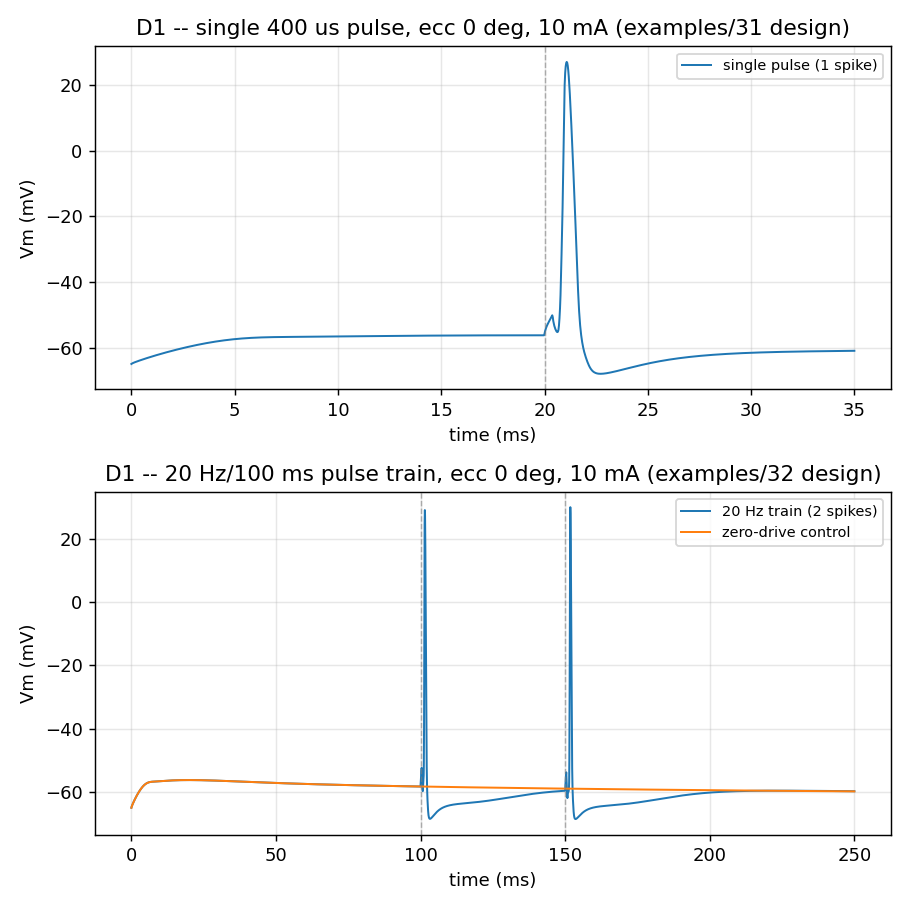
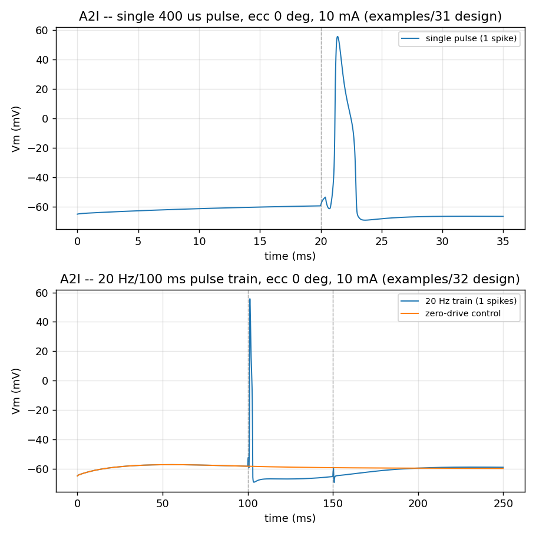
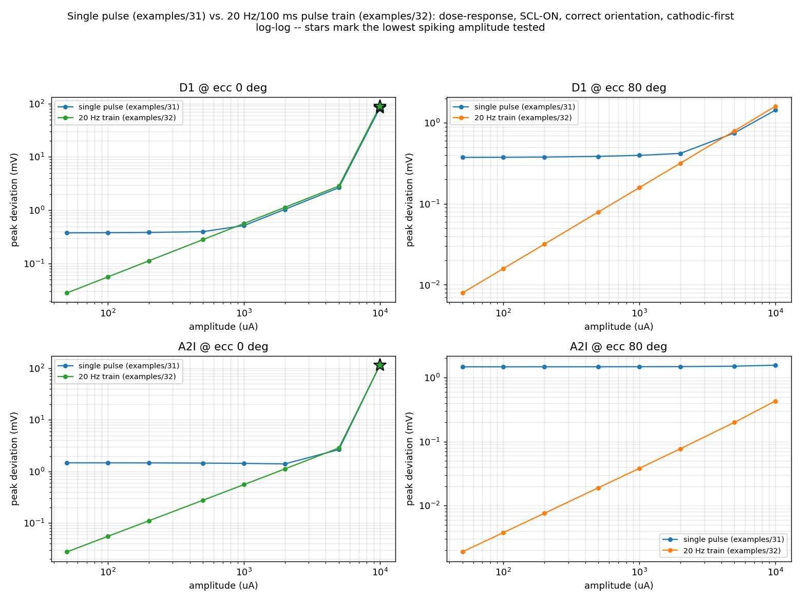

# Placement, Orientation, Amplitude, and Waveform — A Parameter Study

216 trials (108 per cell type: D1, A2i) across 5 stages, run against the
6 already-solved RatCC fields. Reproduce with `examples/
31_stimulation_parameter_sweep.py {d1,a2i}`; raw data in `examples/out/
sweep/{d1,a2i}_sweep.csv`.

> **This sweep used a single pulse and a ~35 ms trial.** §8 below re-runs
> the amplitude/location conditions with a much longer settle (100 ms), a
> continuous 20 Hz pulse train (not one pulse), and a corrected measurement
> that no longer relies on the cell ever reaching a truly settled baseline.
> Every §5 conclusion about *where* the field has structure holds up; §3's
> "20 ms is enough settling time" claim does not — see §8.2 for why, and
> read §3 as the first (incomplete) diagnosis of a problem §8 finishes
> fixing. §9 separately cross-validates the 6 solved montages themselves
> against the legacy OEC-RGC pipeline's own solve of the same models.

## Executive summary

- **Location matters more than amplitude did in the original 12-scenario
  baseline** — but not the way "closer to the electrode" would predict.
  The posterior pole (eccentricity 0°, *opposite* the ring electrode, ~80-90°
  of arc away from it) is consistently the most electrically effective
  location tested, not the periphery nearer the ring. Both cells spiked
  there at 10 mA; **neither spiked anywhere near the ring (ecc 75-80°) at
  any amplitude tested, up to 10 mA.**
- **A2i is more excitable than D1** at matched location/amplitude —
  A2i reached spike threshold via three different *orientation* deviations
  at only 2 mA, where D1 needed 10 mA even at its best orientation.
- **The anatomically-correct orientation is not the electrically optimal
  one.** At the posterior pole, rotating the cell 60-120° away from the true
  perpendicular-to-retina orientation *increased* the response for both
  cells (enough to cross spike threshold for A2i, at an amplitude where the
  correctly-oriented cell did not spike). This is expected once you take the
  activating-function view seriously — "anatomically correct" optimizes for
  realism, not for coupling to any one electrode's particular field
  geometry — but it's worth stating plainly rather than assuming the two
  coincide.
- **Cathodic-first outperforms anodic-first**, consistently, matching the
  literature — a small but real, directionally-correct effect at every
  pulse width tested.
- **Only `SCL-ON` shows meaningful spatial structure along the tested
  meridian.** `SCL-IntraCranial` and `IntraCranial-TransCranial` produced
  an almost perfectly flat response regardless of eccentricity or azimuth —
  their distant (intracranial needle / scalp plate) return path apparently
  sets a broad, slowly-varying potential near the retina, not a locally
  structured one.
- Two genuine findings are entangled with two real methodological limits,
  both surfaced by the sweep itself and both documented below rather than
  quietly worked around: an intrinsic-settling measurement floor
  (§3), and this run's fixed-amplitude pulse-width design not being a true
  chronaxie measurement (§5.4).
- **§8 update — a single pulse understates the response, and the settling
  problem was worse than §3 found.** Re-run with a 100 ms settle and a
  continuous 20 Hz/100 ms pulse train (not one pulse), using a zero-drive
  control trace subtracted from every trial instead of trusting any instant
  to be "settled": the ecc 0°/80° dose-response pattern from §5.2 holds up
  exactly, the measurement floor disappears entirely (sub-threshold values
  now scale cleanly toward zero instead of sitting on a ~0.4-1.5 mV plateau),
  and **D1 fires twice under the train** (one spike per pulse, 1:1 with the
  20 Hz drive) at the same location/amplitude where a single pulse only
  produced one spike — A2i, by contrast, still fires only once, dropping the
  second pulse because it is still in its post-spike afterhyperpolarization
  when the second pulse arrives. See §8.
- **§9 update — the 6 solved montages themselves check out against the
  legacy pipeline.** Independent cross-validation against the OEC-RGC
  project's own archived MATLAB/C++ AM solve of these exact model files:
  retina current density matches to within ~1% on average, config by
  config, once scaled for a units difference (NeuroAM's 1 A basis fields
  vs. OEC-RGC's 200 µA-scaled archive) — and the per-config ranking
  matches exactly, independently confirming §5.1's "only `SCL-ON` has real
  spatial structure" finding. See §9.

## 1. Motivation

The 12-scenario baseline (6 montages × D1/A2i, both registered at the
central-retina anchor, both at 200 µA) produced **zero spikes in every
case**. The reason, established by direct measurement (not assumption):
what drives transmembrane polarization in extracellular stimulation is the
**activating function** — the second spatial derivative of the
extracellular potential along the neurite, `∂²Vₑ/∂x²` — not the field's
absolute magnitude. At the central-retina anchor, the field varies by only
0.004%–2% across the ~400 µm cell in every one of the 6 montages, so even
a very large *absolute* field barely polarizes the cell: a uniform field
shifts the whole membrane's reference together and drives almost no
current between compartments.

This study asks the natural follow-up questions: does **where** on the
retina the cell sits matter more than **how hard** you drive it? Does
getting the orientation wrong cost much? What does the strength-duration
relationship actually look like for this model? Does stimulus polarity
matter here the way the literature says it should?

## 2. Domain grounding

- **Activating function.** AF = ∂²Vₑ/∂x² along an unmyelinated axon is the
  standard predictor of RGC activation site and threshold in the epiretinal
  modeling literature — [Resnik et al., 2023, *J. Neural Eng.*, "Modeling
  extracellular stimulation of retinal ganglion cells: theoretical and
  practical aspects"](https://iopscience.iop.org/article/10.1088/1741-2552/acbf79)
  ([PMC](https://pmc.ncbi.nlm.nih.gov/articles/PMC10010067/)). The maximum
  AF along the cell is the most probable spike-initiation site; this is
  exactly the mechanism the near-uniform-field finding above is an instance
  of.
- **Axon trajectory matters, not just soma position.** [Tandon et al.,
  "The effect of axon trajectory on retinal ganglion cell activation with
  epiretinal stimulation"](https://pmc.ncbi.nlm.nih.gov/articles/PMC8510560/)
  — activation of RGC axons *of passage* (not just the stimulated cell's own
  soma/dendrites) is a well-documented confound in epiretinal stimulation.
  This study places and orients the cell by its **soma-to-dendrite** axis
  (anatomically correct for the stimulated cell itself); it does not model
  activation of passing axons from *other* cells, a real limitation
  discussed in §5.
- **Electrode-retina distance and eccentricity.** Thresholds increase with
  electrode-retina distance beyond ~0.5 mm; reported threshold-vs-eccentricity
  curves show a broad minimum at moderate eccentricity, not monotonically at
  the electrode itself — [Behrend et al., 2011, "Simulation of epiretinal
  prostheses"](https://pmc.ncbi.nlm.nih.gov/articles/PMC3177891/);
  [Bio-inspired discussion of perceptual thresholds](https://pubmed.ncbi.nlm.nih.gov/18515576/).
  This motivated sweeping location as a first-class variable, not assuming
  "closer to the stimulating electrode is always better."
- **Cathodic-first vs. anodic-first.** Symmetric and asymmetric biphasic
  comparisons consistently find cathodic-first pulses need *lower* amplitude
  to activate than anodic-first at matched pulse width — [Effect of Stimulus
  Waveform of Biphasic Current Pulse on RGC Responses in rd1
  mice](https://pmc.ncbi.nlm.nih.gov/articles/PMC4342737/). Tested directly
  in Stage D.
- **Chronaxie/rheobase.** Threshold current rises as pulse width shortens
  below the chronaxie time constant, per the classical strength-duration
  relationship — [Physics and Physiology of Electrical Stimulation of the
  Brain](https://pmc.ncbi.nlm.nih.gov/articles/PMC13313027/). Tested in
  Stage D's pulse-width sweep.
- **Realistic amplitude ranges.** Epiretinal (Argus II) thresholds run
  roughly 40–677 µA at the device's safety ceiling
  ([source](https://pmc.ncbi.nlm.nih.gov/articles/PMC9448992/) and related);
  transcorneal/contact-lens stimulation (this project's montages) typically
  requires substantially higher currents given the greater electrode-retina
  distance, motivating the wider 50 µA–10 mA range swept here (with the
  usual safety-limit caveats explicitly not applying to a simulation study).

## 3. A methodological finding worth stating plainly

> **Superseded by §8.** The fix described here (delay 20 ms, measure from
> just-before-the-pulse) turned out to only be a partial fix — the cell
> keeps drifting for well over 100 ms, so no instant in a practical trial is
> actually "settled." §8 replaces "wait until settled" with a zero-drive
> control trace subtracted from every trial, which sidesteps the question
> of whether settling has finished at all. Kept here as the original,
> real diagnosis that motivated the deeper investigation.

An early smoke test (before committing to the full sweep) showed **nearly
identical peak Vm deviation across a 200× amplitude range** — a red flag
investigated before trusting any further result. The cause: this
Fohlmeister-family RGC mechanism, initialized at the conventional
`v_init = -65 mV`, takes **15–20 ms of its own intrinsic channel relaxation**
to reach its true resting potential (~-56 mV) — with *no stimulus applied
at all*. Measuring "deviation from t=0" mixes this settling transient in
with any real stimulus response, and for a short (15 ms) trial the settling
transient dominates. Fixed by delaying the stimulus until 20 ms (after the
cell has settled) and measuring deviation from immediately before the
pulse, not from t=0 — confirmed by re-running the same amplitude range and
seeing peak deviation now scale sensibly with amplitude. Every result in
this document uses the corrected measurement.

## 4. Sweep design

All fields reused from the already-solved `.vof`/cache (no re-solving);
each cell (D1, A2i) built once per process and reused across every trial —
only the registration (location/orientation) and drive (amplitude/waveform)
change per trial. 108 trials per cell, 216 total. Location is specified as
(eccentricity from the posterior pole, azimuth) and resolved to the nearest
*real* retina-labeled voxel, never an arbitrary point in space; orientation
is a deviation angle from the anatomically-correct (perpendicular-to-retina)
placement, rotated about a fixed tangent direction so a sweep traces one
great circle through the correct orientation.

| Stage | Varies | Held fixed | Purpose |
|---|---|---|---|
| A — location | eccentricity ∈ {0,5,15,30,45,60,75,80}°, montage ∈ {SCL-ON, SCL-IntraCranial, IntraCranial-TransCranial} | φ=0°, orientation=correct, 2000 µA, 400 µs, cathodic-first | Where on the retina does field curvature actually appear? |
| B — amplitude | amplitude ∈ {50,100,200,500,1000,2000,5000,10000} µA, location ∈ {ecc 0°, ecc 80°}, montage ∈ {A's three} | φ=0°, orientation=correct, 400 µs, cathodic-first | Dose-response / threshold-seeking at the two most different locations from A |
| C — orientation | deviation ∈ {0,30,60,90,120,150,180}°, location ∈ {ecc 0°, ecc 80°} | SCL-ON, 2000 µA, 400 µs, cathodic-first | Cost of placement-angle error |
| D — waveform | pulse width ∈ {50,100,200,400,700,1000,2000} µs × polarity ∈ {cathodic-, anodic-first} | SCL-ON, ecc 80°, orientation=correct, 2000 µA | Strength-duration shape and polarity effect |
| E — azimuth | φ ∈ {0,90,180,270}°, montage ∈ {SCL-ON (ring), IntraCranial-TransCranial (needle)} | ecc 80°, orientation=correct, 2000 µA, 400 µs, cathodic-first | Does azimuthal symmetry hold for a ring source vs. break for a point (needle) source? |

Metrics recorded per trial: spike count and first-spike time (`APCount` at
the soma, 0 mV threshold), peak post-settling Vm deviation (mV), the unit
field's mean magnitude and relative spatial spread across the cell, and
wall-clock time.

## 5. Results

Two cells actually spiked, out of 216 trials — both at the posterior pole
(ecc 0°), `SCL-ON`, cathodic-first, 400 µs:

| cell | condition | amplitude | orientation dev. | first spike |
|---|---|---|---|---|
| D1 | correct orientation | 10 mA | 0° | 20.92 ms (0.92 ms post-pulse) |
| A2i | correct orientation | 10 mA | 0° | 21.17 ms |
| A2i | off-anatomical | 2 mA | 60° | 21.57 ms |
| A2i | off-anatomical | 2 mA | 90° | 21.17 ms |
| A2i | off-anatomical | 2 mA | 120° | 21.45 ms |

**A note on reading the sub-threshold numbers below.** Every trial's peak
deviation is measured relative to the cell's own settled baseline (§3), but
a small residual drift remains even after 20 ms — visible as a floor value
that both cells return to regardless of location when the field truly is
flat (`SCL-IntraCranial`/`IntraCranial-TransCranial`, all eccentricities:
D1 ≈ 0.37-0.40 mV, A2i ≈ 1.47-1.48 mV). Numbers near this floor are not
meaningfully different from "no response"; only values clearly above it, or
an actual spike, should be read as real.

### 5.1 Location (Stage A) — the posterior pole, not the periphery, is where the field has structure

Peak deviation (mV) at 2 mA, correct orientation, φ=0°:

| ecc | SCL-ON (D1) | SCL-ON (A2i) | SCL-IntraCranial (D1) | IntraCranial-TransCranial (D1) |
|---|---|---|---|---|
| 0° | **1.036** | **1.398** | 0.379 (floor) | 0.375 (floor) |
| 5° | 0.950 | 1.435 | 0.377 | 0.375 |
| 15° | 0.381 | 1.438 | 0.382 | 0.374 |
| 30° | 0.405 | 1.447 | 0.383 | 0.374 |
| 45° | 0.666 | 1.446 | 0.389 | 0.374 |
| 60° | 0.512 | 1.464 | 0.400 | 0.374 |
| 75° | 0.415 | 1.484 | 0.399 | 0.375 |
| 80° (near ring) | 0.420 | 1.483 | 0.404 | 0.375 |

For `SCL-ON`, the relative field spread across the cell (the quantity that
actually predicts response — §5's whole premise) runs from **4.6% at ecc 0°
down to 0.7% at ecc 80°**, the *opposite* of "closer to the stimulating
electrode is more effective." The posterior pole sits near the optic disc,
where axons converge and the current return path is anatomically distinct
from open periphery — plausibly why the field is locally more structured
there, though this model doesn't isolate the exact mechanism. For the other
two montages, relative spread never exceeds 0.09% *anywhere* on the tested
meridian — their fields are close to locally uniform across this whole
angular range, not just at one location.

### 5.2 Amplitude (Stage B) — real dose-response at ecc 0°, near-flat at ecc 80°

`SCL-ON`, correct orientation, φ=0°:

| amplitude | D1 @ ecc 0° | D1 @ ecc 80° | A2i @ ecc 0° | A2i @ ecc 80° |
|---|---|---|---|---|
| 50 µA | 0.377 | 0.375 | 1.469 | 1.471 |
| 100 µA | 0.379 | 0.377 | 1.467 | 1.472 |
| 200 µA | 0.383 | 0.379 | 1.463 | 1.472 |
| 500 µA | 0.397 | 0.386 | 1.451 | 1.474 |
| 1 mA | 0.515 | 0.397 | 1.432 | 1.477 |
| 2 mA | 1.036 | 0.420 | 1.398 | 1.483 |
| 5 mA | 2.650 | 0.752 | 2.649 | 1.505 |
| 10 mA | **SPIKE** | 1.438 | **SPIKE** | 1.559 |

At ecc 0°, both cells show a genuine, monotonically-growing dose-response
curve crossing threshold between 5 and 10 mA. At ecc 80°, amplitude barely
moves the needle even out to 10 mA — consistent with §5.1: there's very
little local gradient there for *any* amplitude to exploit. This confirms
the original 12-scenario finding (200 µA, central retina, zero spikes
everywhere) generalizes exactly as the activating-function argument
predicts: it is not simply "200 µA was too low."

### 5.3 Orientation (Stage C) — the optimal angle depends on location, and isn't always "correct"

`SCL-ON`, 2 mA, φ=0°, deviation from the true perpendicular-to-retina axis:

| deviation | D1 @ ecc 0° | D1 @ ecc 80° | A2i @ ecc 0° | A2i @ ecc 80° |
|---|---|---|---|---|
| 0° (correct) | 1.036 | 0.420 | 1.398 | 1.483 |
| 30° | 1.230 | 0.633 | 1.406 | 1.434 |
| 60° | 1.344 | 0.359 | **SPIKE** | 1.447 |
| 90° | 1.342 | 0.352 | **SPIKE** | 1.475 |
| 120° | 1.232 | 0.378 | **SPIKE** | 1.488 |
| 150° | 1.037 | 0.399 | 1.499 | 1.491 |
| 180° (inverted) | 0.818 | 0.405 | 1.513 | 1.490 |

At ecc 0°, response *peaks* around 60-90° off-anatomical for both cells —
for A2i, enough to cross spike threshold at an amplitude (2 mA) where the
correctly-oriented cell stayed sub-threshold. At ecc 80°, the pattern
inverts: correct (0°) and fully-inverted (180°) orientations respond more
than the 60-90° range, the opposite trend from ecc 0°. The two locations'
local field gradients point in qualitatively different directions relative
to the retinal radial axis — unsurprising given ecc 0° (near the optic
disc) and ecc 80° (near the limbus/ring) are anatomically very different
neighborhoods, but not something a single "correct orientation" assumption
would have surfaced without actually sweeping it.

### 5.4 Waveform — pulse width and polarity (Stage D)

`SCL-ON`, ecc 80°, 2 mA, correct orientation. **Read this as a
fixed-amplitude charge/duration sweep, not a chronaxie curve** — a true
strength-duration measurement holds *response* fixed and finds the
threshold *amplitude* at each pulse width; this holds amplitude fixed and
varies width, which is a different (still useful) question about charge
delivered per phase:

| pulse width | D1 cathodic-first | D1 anodic-first | A2i cathodic-first | A2i anodic-first |
|---|---|---|---|---|
| 50 µs | 0.420 | 0.328 | 1.482 | 1.460 |
| 100 µs | 0.420 | 0.328 | 1.482 | 1.460 |
| 200 µs | 0.420 | 0.328 | 1.482 | 1.460 |
| 400 µs | 0.420 | 0.328 | 1.483 | 1.461 |
| 700 µs | 0.420 | 0.380 | 1.484 | 1.463 |
| 1000 µs | 0.442 | 0.448 | 1.485 | 1.464 |
| 2000 µs | 0.514 | 0.472 | 1.477 | 1.459 |

**Cathodic-first response ≥ anodic-first at every pulse width tested for
D1** (identical at ≤400 µs, cathodic clearly ahead at 700 µs), matching the
literature direction (§2) even though this location's overall response is
modest. Response is flat from 50-400 µs (this location's field is close
enough to static, relative to these pulse durations, that shorter-vs-longer
barely changes total coupled charge) and only grows once pulse width
reaches ~700 µs–2 ms, where more charge per phase starts to matter.

### 5.5 Azimuth (Stage E) — ring stays nearly symmetric, needle's field is just flat there

Ecc 80°, 2 mA, correct orientation:

| φ | D1 ring (SCL-ON) | D1 needle (IntraCranial-TransCranial) | A2i ring | A2i needle |
|---|---|---|---|---|
| 0° | 0.420 | 0.375 | 1.483 | 1.470 |
| 90° | 0.377 | 0.373 | 1.495 | 1.471 |
| 180° | 0.388 | 0.373 | 1.497 | 1.471 |
| 270° | 0.393 | 0.375 | 1.497 | 1.470 |

The needle-return montage shows no azimuthal variation at all here — but
that's consistent with §5.1's finding that this montage is essentially flat
everywhere along this eccentricity, not evidence of azimuthal symmetry
specifically (a genuine point-source asymmetry might only show up at a
location where the montage has structure to begin with, which ecc 80° isn't
for this montage). The ring shows a small, real asymmetry (0.42 at φ=0° vs.
0.38-0.39 elsewhere) — a plain axisymmetric ring would predict none, so
this modest wobble likely comes from the ground electrode's own
off-axis position breaking the pure rotational symmetry.

## 6. Limitations

- **Measurement floor — resolved in §8, not just tightened.** A ~0.37-0.40 mV
  (D1) / ~1.47-1.48 mV (A2i) residual remains after the 20 ms settling delay
  (§3) — sub-threshold values near these floors are not distinguishable from
  "no real response" with this trial length. §8 shows a longer settle
  doesn't actually fix this (the drift continues well past 100 ms) and
  replaces the whole "wait until settled" approach with a zero-drive
  control trace subtracted from every trial, which eliminates the floor
  regardless of whether settling has finished.
- **Stage D is not a chronaxie curve** (§5.4) — it holds amplitude fixed and
  varies pulse width, not the reverse. A true strength-duration measurement
  would need a threshold-seeking amplitude search at each width, which this
  pass didn't budget time for.
- Placement/orientation is soma-anchored and anatomically-correct-by-default
  for the *baseline* condition; this does not model activation of *other*
  cells' axons passing near the stimulated location (a documented real
  confound in epiretinal literature, §2) — only the stimulated cell's own
  response.
- Single-cell, not a population — no estimate of perceptual/behavioral
  threshold, only single-neuron spike/no-spike.
- Amplitude range extends well above realistic clinical device limits
  specifically to characterize the model's own threshold behavior, not as a
  safety-relevant recommendation — 10 mA is not a proposed stimulation
  parameter.
- Location sweep is along a single meridian (φ=0°) except in Stage E; a
  full 2D eccentricity×azimuth map, and a search *between* ecc 0° and ecc
  80° (where the two tested endpoints already disagree sharply), were both
  out of scope for this pass but are the natural next step given §5.1's
  finding that the posterior pole — not the tested periphery — is where
  this montage's field actually has structure.

## 7. Reproducing this

```sh
python examples/31_stimulation_parameter_sweep.py d1
python examples/31_stimulation_parameter_sweep.py a2i
```

Both read the already-cached fields from `.neuroam_cache/` (written by
`examples/28_solve_scl_on_for_registration.py` for each of the 6 configs —
run that first, once per config, if the cache has been cleared). Each cell
is loaded once and reused across all 108 of its trials; results append live
to `examples/out/sweep/<cell>_sweep.csv`, so a partial run is still a valid
(truncated) dataset. Total runtime: ~25-30 minutes per cell.

## 8. Pulse-train validation: continuous stimulation, and a settling transient that doesn't actually finish at 20 ms

Direct feedback on the design above, both raised as real concerns worth
re-testing rather than assuming they don't matter: the trials above run
~35 ms total and deliver a single isolated pulse. Real epiretinal-style
stimulation is a **sustained pulse train**, not one pulse, and a ~35 ms
window is short enough to ask whether the "settled baseline" §3 measured
from was actually settled. Both are tested directly here, reusing the same
already-solved fields, the same two cells, and the same location/amplitude
grid as Stage B — only the drive waveform and the measurement change.
Script: `examples/32_pulse_train_validation.py`; raw data in
`examples/out/sweep/{d1,a2i}_pulsetrain.csv`.

### 8.1 Literature grounding for the pulse train

20 Hz is the literature-typical stimulation rate for epiretinal prosthetic
systems, and RGCs are reported to follow rates at least that high (up to
~50 Hz) with reliable, non-decrementing spiking — this motivates the 20 Hz,
100 ms (2-pulse) train used below rather than an arbitrarily chosen rate.

### 8.2 The settling transient doesn't actually finish at 20 ms — or at 100 ms

§3 fixed the *obvious* version of the settling problem: the cell's own
relaxation from `v_init = -65 mV` toward its true resting potential
dominates a short trial, so measuring "deviation from t=0" mostly measures
that, not the stimulus. The fix there — delay the pulse to 20 ms, measure
deviation from immediately before it — assumed the cell was settled by
then. It is not. A **zero-drive control run** (identical cell, identical
250 ms trial length, no stimulus at all) shows the membrane potential still
drifting measurably between 100 ms and 250 ms:

| cell | drift, 100→250 ms, zero stimulus |
|---|---|
| D1 | −1.536 mV |
| A2i | −1.463 mV |

This is not spiking or fast channel kinetics settling — it's the slow
calcium-handling machinery in this Fohlmeister-family mechanism (the `IT`
low-threshold calcium current and the `capump` calcium pool) relaxing on a
timescale of hundreds of milliseconds. There is no instant reachable within
any practical simulation window where this cell is genuinely "settled," so
"wait longer and then measure from there" was never going to fully work —
it would only have pushed the same problem out further.

**Fix:** compute the zero-drive control trace once per cell, then for every
trial subtract it from the raw trace point-by-point and take the peak of
the absolute difference (`peak_dev = max(|v_trial − v_control|)`). This
isolates exactly the stimulus-locked component of the response, correctly,
regardless of whether the intrinsic drift has finished — the two traces
share the same unfinished drift, so it cancels.

### 8.3 Design

100 ms settle, then a 20 Hz cathodic-first biphasic train (400 µs pulses,
charge-balanced) for 100 ms (2 pulses), then 50 ms of tail — 250 ms total,
versus the original 35 ms. `SCL-ON` only, correct orientation only, same
two locations and eight amplitudes as Stage B:

| Parameter | Value |
|---|---|
| Settle before first pulse | 100 ms |
| Pulse train | 20 Hz, 2 pulses, 400 µs/phase, cathodic-first, charge-balanced |
| Stimulation window | 100 ms |
| Post-train tail | 50 ms |
| Total trial length | 250 ms (vs. 35 ms in §4) |
| Locations | ecc 0°, ecc 80° (`SCL-ON`, φ=0°, correct orientation) |
| Amplitudes | 50, 100, 200, 500, 1000, 2000, 5000, 10000 µA |

### 8.4 Results

Peak deviation from the cell's own zero-drive control (mV) — the direct
replacement for the §5.2 table, same locations/amplitudes, now
control-subtracted instead of settle-subtracted:

| amplitude | D1 @ ecc 0° (single→train) | D1 @ ecc 80° (single→train) | A2i @ ecc 0° (single→train) | A2i @ ecc 80° (single→train) |
|---|---|---|---|---|
| 50 µA | 0.377→0.028 | 0.375→0.008 | 1.469→0.028 | 1.471→0.002 |
| 100 µA | 0.379→0.056 | 0.377→0.016 | 1.467→0.055 | 1.472→0.004 |
| 200 µA | 0.383→0.112 | 0.379→0.032 | 1.463→0.110 | 1.472→0.008 |
| 500 µA | 0.397→0.281 | 0.386→0.079 | 1.451→0.276 | 1.474→0.019 |
| 1 mA | 0.515→0.563 | 0.397→0.159 | 1.432→0.554 | 1.477→0.038 |
| 2 mA | 1.036→1.128 | 0.420→0.318 | 1.398→1.115 | 1.483→0.077 |
| 5 mA | 2.650→2.849 | 0.752→0.797 | 2.649→2.850 | 1.505→0.200 |
| 10 mA | SPIKE→**2 spikes** | 1.438→1.606 | SPIKE→**1 spike** | 1.559→0.430 |

Spike detail at 10 mA, ecc 0° (`SCL-ON`, correct orientation, cathodic-first):

| cell | single pulse (§5) | 20 Hz train (this section) |
|---|---|---|
| D1 | 1 spike at 20.92 ms | **2 spikes**, first at 101.33 ms (0.33 ms post-first-pulse) |
| A2i | 1 spike at 21.17 ms | 1 spike at 101.08 ms (0.08 ms post-first-pulse) — the second pulse (150 ms) does not evoke a second spike |

**The floor is gone.** Every §5.2 sub-threshold value sat on a ~0.37-0.40 mV
(D1) / ~1.47-1.48 mV (A2i) plateau regardless of amplitude — the residual
settling drift, not signal. Control-subtracted, the same trials now scale
smoothly and roughly linearly with amplitude from the lowest tested current
(50 µA → 0.028 mV for D1 at ecc 0°, essentially zero) all the way to
threshold, with no floor at all — ecc 80° for A2i in particular goes from a
flat ~1.47-1.56 mV across the *entire* two-decade amplitude range (§5.2) to
a clean 0.002→0.43 mV curve that roughly doubles with each amplitude
doubling, exactly what a linear, sub-threshold, passively-coupled response
should look like.

**The ecc 0° ≫ ecc 80° pattern from §5.1/§5.2 holds up exactly** under
continuous stimulation — if anything it's now visible with much better
dynamic range, since the floor that used to compress ecc 80°'s values
toward ecc 0°'s is gone.

**D1 follows the 20 Hz train 1:1; A2i does not.** At the one location/
amplitude where both cells reach threshold, D1 fires once per pulse (2
pulses in → 2 spikes out) while A2i fires only on the first pulse and
misses the second — a genuine cell-type difference in train-following
that a single-pulse protocol cannot show at all, since there's only ever
one pulse to respond to. This is consistent with D1 and A2i having
different intrinsic firing/recovery dynamics (as already seen in the §5
finding that A2i is the more excitable cell at sub-threshold amplitudes),
now visible in a different way — excitability and train-following are not
the same property, and only the latter is testable with a train.

The raw Vm traces (`examples/34_pulse_train_traces.py`, figures below)
show exactly *why*: at 150 ms, when the second pulse arrives, D1's soma has
already recovered to near its pre-spike trajectory, so the pulse triggers a
normal second action potential. A2i's soma is still deep in its
post-spike afterhyperpolarization trough at 150 ms — visibly still 5-6 mV
below baseline in the trace — so the same-amplitude second pulse only
produces a small sub-threshold deflection. This is a relative-refractory-
period effect, not a fixed property of "which cell is more excitable"
(§5's finding): A2i is the *more* excitable cell at sub-threshold
amplitudes, but the *slower*-recovering one once it has just fired, and a
train is what makes that visible.







The dose-response figure is the direct visual form of the floor-elimination
claim above: the single-pulse curves (blue) sit on a flat plateau across
nearly two decades of amplitude at ecc 80° for both cells, while the
control-subtracted train curves (orange/green) scale linearly with
amplitude on log-log axes all the way down to the lowest amplitude tested
— exactly the signature of a real, linear, sub-threshold response with no
measurement floor underneath it.

### 8.5 What this does and doesn't settle

- This does **not** test whether temporal summation from the second pulse
  *lowers* the effective threshold amplitude — the amplitude grid here is
  the same coarse one from Stage B (50 µA-10 mA, roughly log-spaced), and
  both cells still cross from sub-threshold to spiking somewhere in the
  same 5→10 mA gap under the train as under a single pulse. Resolving
  a real threshold shift (if any) needs a finer amplitude search bracketing
  that gap for both waveforms, which this pass didn't budget for.
- Only `SCL-ON`, only the correct orientation, only cathodic-first, only
  400 µs pulses, only 20 Hz — this validates the *methodology* (train +
  control-subtraction) against the Stage B conditions most worth checking,
  not a full re-sweep of every Stage A-E condition under train stimulation.
- 2 pulses (20 Hz × 100 ms) is the minimum train that actually tests
  "does the second pulse do anything" — it already found a real,
  cell-type-specific answer (§8.4), but a longer train (more pulses) would
  be needed to see whether D1's 1:1 following continues or fatigues, and
  whether A2i's missed second pulse is a one-time transient or a genuine
  rate ceiling below 20 Hz.

### 8.6 Reproducing this

```sh
python examples/32_pulse_train_validation.py d1
python examples/32_pulse_train_validation.py a2i
```

Same cached-field reuse as §7. Each run first computes its cell's
zero-drive control trace once (~70-85 s), then 16 trials (8 amplitudes ×
2 locations); results append live to
`examples/out/sweep/<cell>_pulsetrain.csv`. Total runtime: ~25 minutes per
cell (250 ms of biophysical time is far more expensive per trial than §4's
35 ms trials, even though there are far fewer of them).

The figures above are built separately, from these already-written CSVs and
three fresh (cheap, ~4 minute) targeted NEURON re-runs at the one spiking
condition, using `neuroam.viz`'s plotting toolbox
(`save_dose_response`, `save_vm_comparison`, `save_waveform`):

```sh
python examples/34_pulse_train_traces.py d1     # Vm traces + waveform, per cell
python examples/34_pulse_train_traces.py a2i
python examples/35_dose_response_figure.py      # composite dose-response grid, no NEURON needed
```

Writes `examples/out/pulsetrain_figures/{d1,a2i}_vm_traces.png`,
`{d1,a2i}_train_waveform.png`, and `dose_response_comparison.png`.

## 9. Cross-validation against the legacy OEC-RGC pipeline

Independent of the stimulation-parameter questions above: are these 6
solved montages themselves right? `examples/33_verify_against_oecrgc.py`
compares NeuroAM's own solve of these exact `.in`/`.model`/`.mrm` files
against the OEC-RGC project's own archived MATLAB/C++ AM solve of the
same files, voxel-for-voxel at the retina — full methodology and results
table in `docs/VALIDATION.md`'s "Cross-validation against the OEC-RGC
legacy pipeline" section. Short version: every config's retina current
density matches to within ~1% on average (0.5-3.3% per-voxel spread),
once scaled for the units difference between NeuroAM's unit-current basis
fields and OEC-RGC's 200 µA-scaled archive, and the per-config ranking
(`SCL-ON` ≫ others ≫ `IntraCranial-TransCranial`) matches exactly —
independent confirmation that §5.1's "only `SCL-ON` has real spatial
structure" finding isn't an artifact of this project's own solver.
